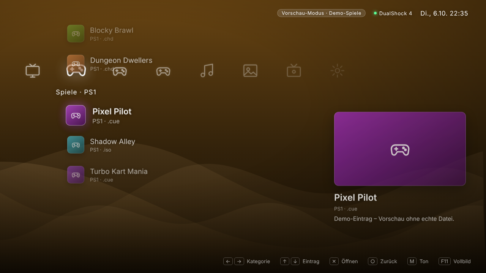

# JellyStation auf dem Mac installieren, bauen und starten

Diese Anleitung bringt dich vom leeren Mac zur laufenden App. Bilder zeigen, was dich erwartet.
Die Screenshots stammen aus der Browser-Vorschau der App; das native Fenster sieht gleich aus, hat aber
zusätzlich den echten macOS-Ordnerdialog.

> **Abkürzung:** Wenn du nichts tippen möchtest als nötig, erledigt `./scripts/setup-mac.sh --install-missing`
> die Schritte 1–4 in einem Rutsch (siehe [Schnellweg](#schnellweg-ein-befehl)).

---

## 0. Was am Ende läuft

| Setup-Assistent (Start ohne Konfiguration) | Hauptmenü (XMB) |
| --- | --- |
|  |  |

---

## 1. Werkzeuge installieren (einmalig)

Öffne das **Terminal** (Spotlight: `Cmd + Leertaste`, „Terminal“ eintippen, Enter).

**1a. Xcode Command Line Tools** (Compiler für den Rust-Teil):

```bash
xcode-select --install
```

Es öffnet sich ein Fenster → **Installieren** → Lizenz akzeptieren → warten (einige Minuten).

**1b. Node.js** (Version 20 oder neuer) – mit [Homebrew](https://brew.sh):

```bash
brew install node
node -v    # sollte v20 oder höher zeigen
```

Ohne Homebrew kannst du Node auch von <https://nodejs.org> (LTS) installieren.

**1c. Rust:**

```bash
curl --proto '=https' --tlsv1.2 -sSf https://sh.rustup.rs | sh
```

Wähle **1) Proceed with standard installation**. Danach das Terminal **schließen und neu öffnen**
(oder `source "$HOME/.cargo/env"` ausführen) und prüfen:

```bash
rustc --version
```

---

## 2. Projekt herunterladen

```bash
cd ~/Documents                      # oder ein Ordner deiner Wahl
git clone https://github.com/dconair/jellystation.git
cd jellystation
git checkout claude/serene-ride-x8ll06   # der Branch mit diesem Stand
```

---

## 3. Pakete installieren und App im Entwicklungsmodus starten

```bash
npm install
npm run tauri dev
```

- Beim **ersten Mal** kompiliert Rust alle Abhängigkeiten – das dauert **5–15 Minuten**. Danach startet es in Sekunden.
- Es öffnet sich das Fenster „JellyStation“. Änderungen am Code erscheinen live.
- Beenden: im Terminal `Strg + C`.

> Falls beim ersten Kompilieren eine Fehlermeldung erscheint: Das Rust-Backend konnte in der Cloud-Umgebung, in
> der dieser Code entstanden ist, nicht kompiliert werden (dort fehlen die macOS/WebKit-Bibliotheken). Der
> Frontend-Teil ist getestet, der native Teil wird auf deinem Mac zum ersten Mal gebaut. Kopiere die Fehlermeldung
> einfach in Claude (oder in Claude Code, siehe unten) – solche Fehler sind meist Kleinigkeiten.

---

## 4. Fertige App bauen (Release)

```bash
npm run tauri build
```

Ergebnis:

| Datei | Ort |
| --- | --- |
| App | `src-tauri/target/release/bundle/macos/JellyStation.app` |
| Installer | `src-tauri/target/release/bundle/dmg/JellyStation_0.1.0_….dmg` |

Starten und installieren:

```bash
open src-tauri/target/release/bundle/macos/JellyStation.app
# oder im Finder in den Ordner „Programme“ ziehen
```

Da du die App selbst gebaut hast, blockiert Gatekeeper sie nicht. (Auf einem *anderen* Mac würde sie als
„nicht verifiziert“ gemeldet – dafür bräuchte man eine Apple-Entwickler-Signatur.)

---

## 5. Vorbereitung für Spiele (optional, kann auch später passieren)

**RPCS3 installieren:** macOS-Version von <https://rpcs3.net> laden, in **Programme** ziehen, einmal starten und
die PS3-Firmware einrichten. Prüfe den erwarteten Pfad:

```bash
ls /Applications/RPCS3.app/Contents/MacOS/
```

Dort muss die Datei `rpcs3` liegen. Liegt sie woanders, passe den Pfad an in
`src/config/games.ts` (`binary`) **und** `src-tauri/capabilities/emulators.json` (`cmd`).

**Ordnerstruktur anlegen** – ein Unterordner pro System:

```text
Spiele/
├─ PS3/   Gran Turismo 5.iso
├─ PS2/   …
└─ PS1/   …
```

Hinweis zu Dateitypen: `.iso` startet RPCS3 direkt. `.pkg`-Dateien sind bei RPCS3 Installationspakete – sie werden
im Menü gelistet, müssen aber zuerst in RPCS3 über *File → Install .pkg* installiert werden.
Verwende nur Spiele, die du legal besitzt.

**Jellyfin-API-Key:** In Jellyfin unter *Dashboard → API-Schlüssel* einen neuen Schlüssel anlegen.

---

## 6. Der Setup-Assistent beim ersten Start

Beim ersten Start gibt es noch keine gespeicherte Konfiguration. Das Hauptmenü wird deshalb **nicht** geladen,
stattdessen erscheint der Assistent. Er hat vier Schritte (die Symbole △ ○ ✕ □ oben zeigen den Fortschritt).
Jeder Schritt lässt sich mit **Überspringen** auslassen, `Enter` = Weiter, `Esc` = Zurück.

### Schritt 1 – Jellyfin


Server-URL (z. B. `http://192.168.1.20:8096`) und API-Key eintragen, dann **Verbindung testen**.
Grün = Server erreichbar *und* Schlüssel gültig. Rot zeigt, was fehlt (Adresse falsch, Schlüssel ungültig …).

### Schritt 2 – Spiele-Ordner


**Ordner wählen …** öffnet den nativen macOS-Dialog. Wähle den Basisordner (im Beispiel `Spiele`).
Die App zeigt sofort, welche Systeme sie darin findet. Liegt der Ordner in *Dokumente*, *Schreibtisch* oder auf einem
externen Laufwerk, fragt macOS einmalig, ob JellyStation zugreifen darf → **OK**.

### Schritt 3 – Controller

| Wartet | Erkannt | Taste gedrückt |
| --- | --- | --- |
|  |  |  |

DualShock 4 per USB-Kabel anschließen **oder** per Bluetooth koppeln: `PS` + `SHARE` gedrückt halten, bis die
Leuchtleiste blinkt, dann am Mac unter *Systemeinstellungen → Bluetooth* „Wireless Controller“ verbinden.
Danach eine beliebige Taste drücken – das Gamepad-Symbol leuchtet grün.

### Schritt 4 – Prüfung


Die App prüft automatisch: Jellyfin erreichbar · Ordner vorhanden und sinnvoll aufgebaut · RPCS3 unter
`/Applications/RPCS3.app` · hat jedes System einen Emulator · Controller erkannt.
Gelb (!) = Hinweis, Rot (✕) = muss behoben werden. Mit **Erneut prüfen** wiederholst du den Check, nachdem du etwas
korrigiert hast. **Einrichtung abschließen** speichert alles und startet das Hauptmenü neu.

*(Im Browser-Screenshot sind Ordner- und Emulator-Check gelb, weil sie nur in der Desktop-App prüfbar sind.)*

---

## 7. Danach

- Die Einstellungen liegen in `~/Library/Application Support/dev.jellystation.app/settings.json`.
  **Achtung:** Der API-Key steht dort im Klartext.
- Erneut einrichten: im Menü unter **Einstellungen → Einrichtung erneut ausführen**.
- Komplett zurücksetzen (Assistent erscheint wieder):

  ```bash
  rm ~/Library/Application\ Support/dev.jellystation.app/settings.json
  ```

- Bedienung: Pfeiltasten / D-Pad / linker Stick, `Enter` / ✕ bestätigen, `Esc` / ○ zurück, `M` Ton, `F11` Vollbild.
- Ein Spiel starten: im Menü auf den Eintrag gehen und ✕ / `Enter` drücken. RPCS3 öffnet sich, das Menü bleibt im
  Hintergrund geöffnet und zeigt „Läuft“.

---

## 8. Häufige Probleme

| Symptom | Ursache / Lösung |
| --- | --- |
| `command not found: cargo` | Terminal neu öffnen oder `source "$HOME/.cargo/env"` |
| `xcrun: error: invalid active developer path` | Schritt 1a (`xcode-select --install`) nachholen |
| Erster Build dauert ewig | Normal (5–15 Min.), nur beim ersten Mal |
| Port 1420 belegt | Anderes `npm run dev`/`tauri dev` beenden |
| Spiele-Ordner „nicht erlaubt“ im Check | Ordner im Schritt 2 **über den Dialog** wählen (nicht tippen) |
| Start-Fehler „not allowed“ / „scope“ | Emulator-Pfad stimmt nicht mit `capabilities/emulators.json` überein |
| Controller wird nicht erkannt | Erst eine Taste drücken (Browser/WebKit geben Pads erst dann frei); Fenster muss im Vordergrund sein |
| Menü zeigt „Vorschau-Modus · Demo-Spiele“ | Spiele-Ordner nicht gefunden → im Setup erneut wählen |

---

## 9. Kann Claude (Claude Code) das lokal alles selbst erledigen?

**Ja – größtenteils.** Wenn du **Claude Code auf deinem Mac** im Projektordner startest, kann Claude dort selbst
Befehle ausführen: Werkzeuge prüfen, `npm install`, `npm run tauri build`, Fehler lesen, Code reparieren und neu
bauen – ohne dass du etwas abtippst. Das Skript `scripts/setup-mac.sh` bündelt dafür alle Schritte; Claude kann es
einfach aufrufen.

So geht es:

1. Claude Code einmalig installieren und anmelden (Anleitung: <https://code.claude.com/docs>).
2. Im Terminal: `cd jellystation && claude`
3. Sag: *„Richte das Projekt ein, baue die App und starte sie.“*

**Was trotzdem nicht „vollautomatisch ohne dich“ geht** – ehrlich:

- **Der Start ist manuell.** Diese Cloud-Sitzung hat keinen Zugriff auf deinen Mac. Claude Code musst du lokal
  selbst starten (und dich einmal anmelden); es ist dann eine *neue* Sitzung, die nur das Repo und diese Anleitung kennt.
- **Freigaben:** Claude Code fragt standardmäßig vor jedem Befehl um Erlaubnis. Du kannst Befehle vorab erlauben
  oder einen großzügigeren Berechtigungsmodus wählen – dann fällt das Bestätigen weg. Das ist deine Entscheidung.
- **Dinge, die nur ein Mensch tun kann:** das Installationsfenster der Xcode-Tools bestätigen, ein evtl. nötiges
  Admin-Passwort (Homebrew/`sudo`), macOS-Rückfragen zum Dateizugriff, im Setup-Assistenten den Ordner auswählen,
  den Controller koppeln, RPCS3 samt Firmware und deine legal erworbenen Spiele bereitstellen und den
  Jellyfin-API-Key erzeugen.
- **Der Mac-Build ist noch ungetestet.** Falls beim ersten Kompilieren etwas hakt, ist genau das der Fall, in dem
  Claude Code lokal am meisten hilft: Es sieht die echte Fehlermeldung und kann sie sofort beheben.

---

## Schnellweg: ein Befehl

Im Projektordner:

```bash
./scripts/setup-mac.sh --install-missing --open
```

Das Skript prüft Xcode-Tools, Node und Rust (und installiert fehlende, wenn du `--install-missing` angibst),
führt `npm ci` aus, baut die App und öffnet sie. Weitere Optionen: `--dev` (Entwicklungsmodus statt Build),
ohne `--install-missing` wird nichts am System installiert, sondern nur gemeldet, was fehlt.
