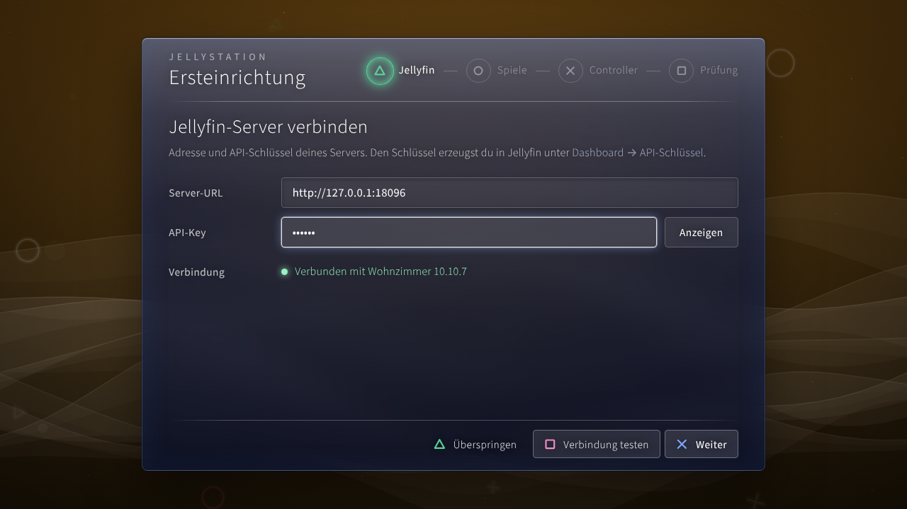
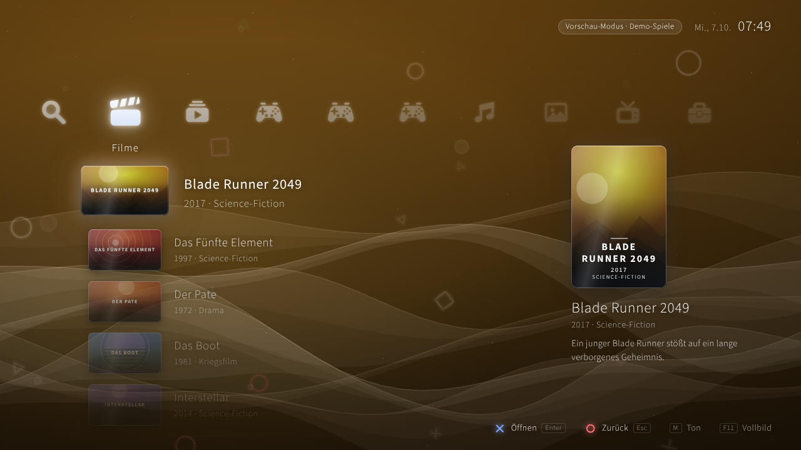
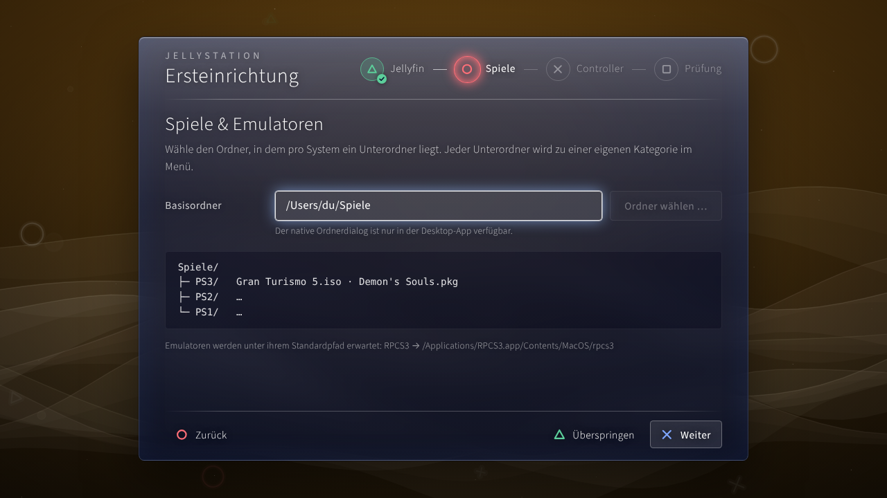
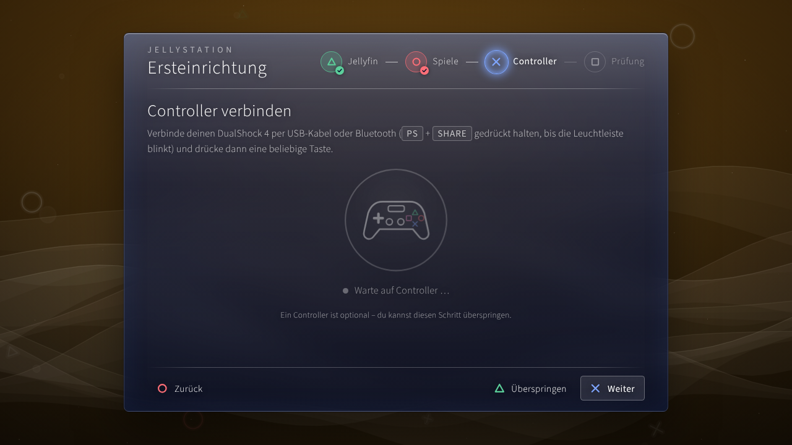
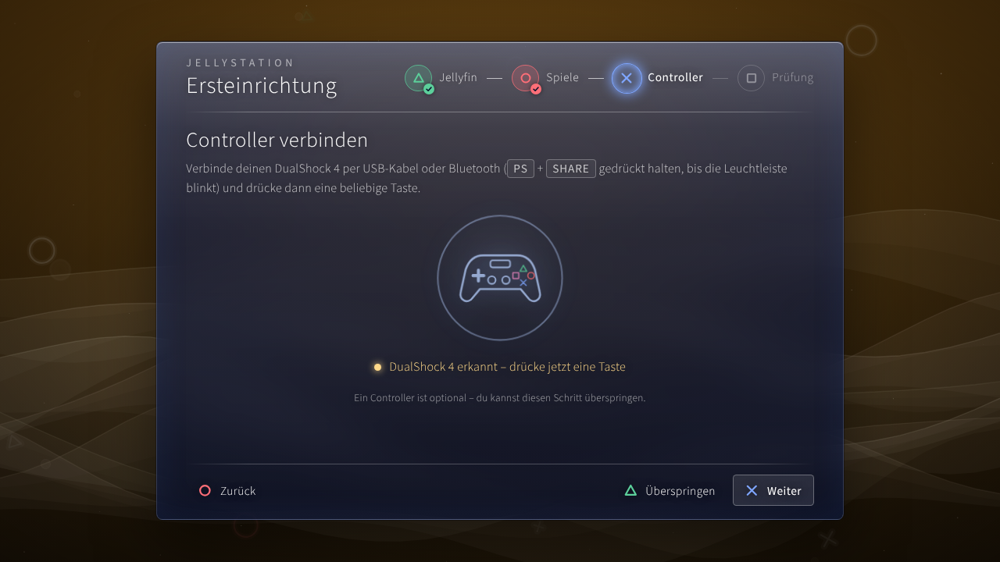
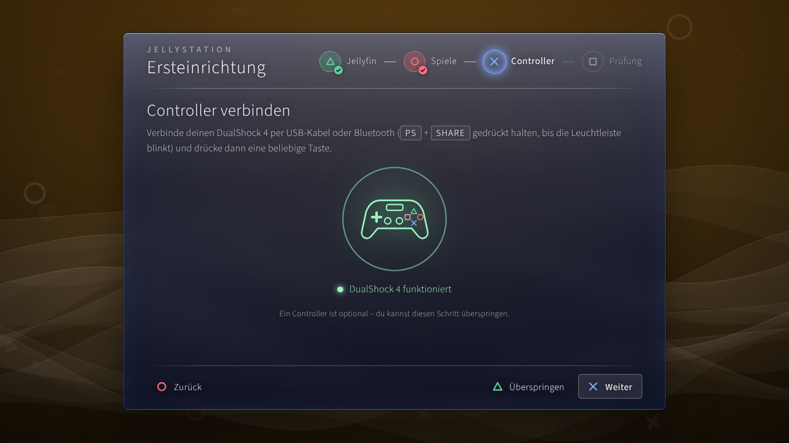
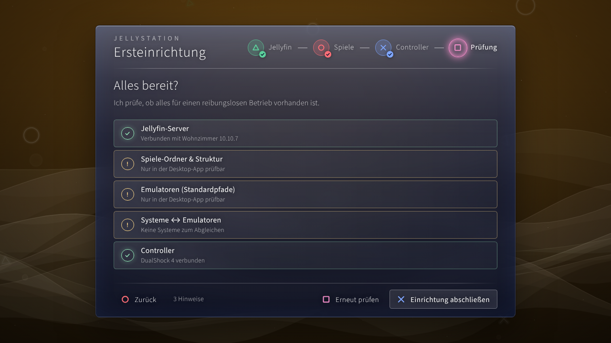
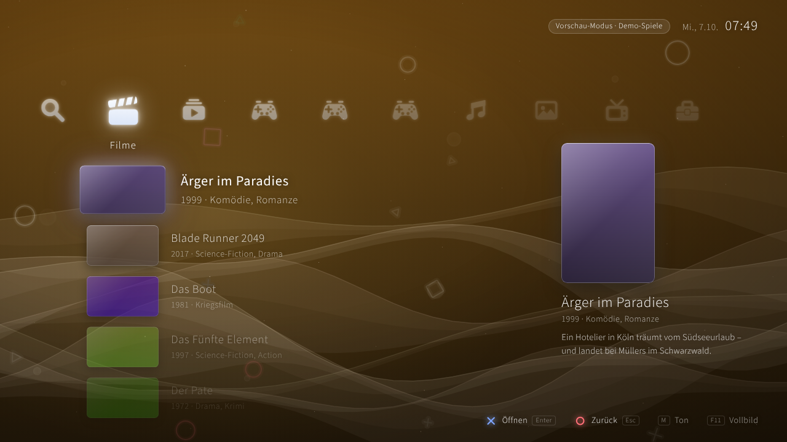
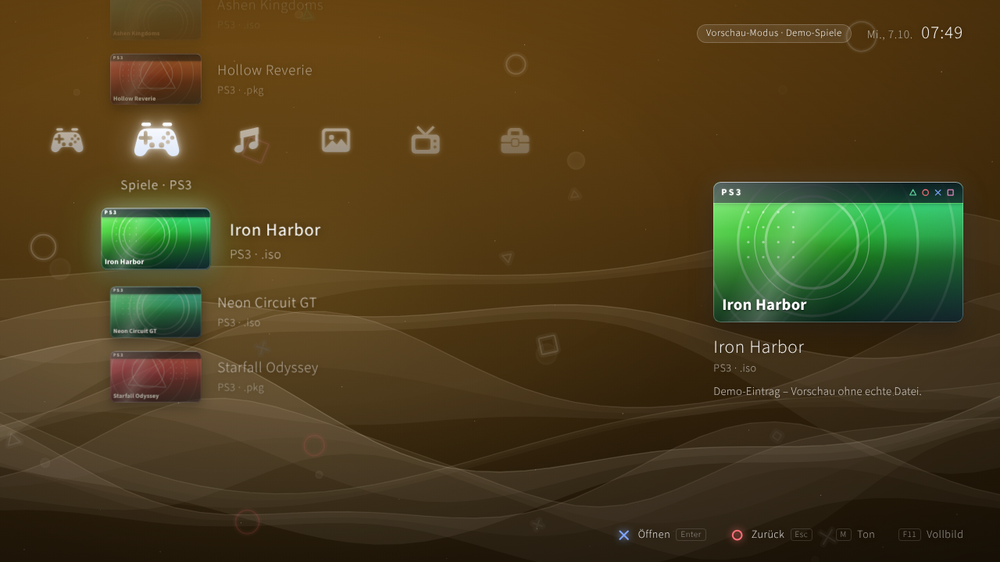
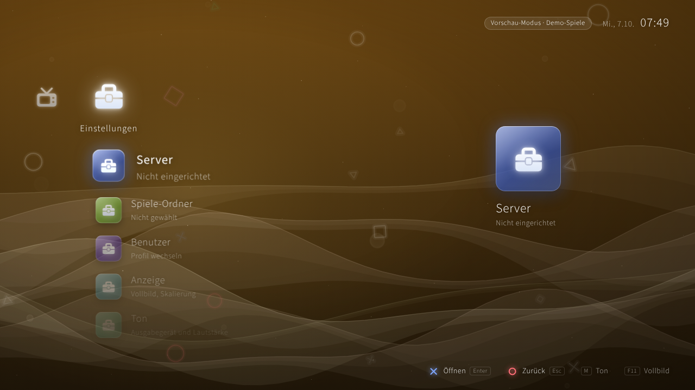

# JellyStation auf dem Mac: installieren, starten, aktuell halten

Diese Anleitung ist für den Alltag gedacht: **Einmal einrichten, danach immer nur ein Befehl** – er holt die neueste
Version von GitHub und startet die App. Die Bilder stammen aus der Browser-Vorschau; im echten Fenster sieht es gleich aus,
nur dass dort zusätzlich der echte macOS-Ordnerdialog und der Emulator-Start funktionieren.

| Setup-Assistent | Hauptmenü mit Cover-Kacheln |
| --- | --- |
|  |  |

---

## 1. Einmalig einrichten (ein Befehl)

Öffne das **Terminal** (`Cmd + Leertaste`, „Terminal“ tippen, Enter) und füge diese **eine Zeile** ein:

```bash
bash -c "$(curl -fsSL https://raw.githubusercontent.com/dconair/jellystation/claude/serene-ride-x8ll06/scripts/bootstrap.sh)"
```

Was das Skript macht (du siehst jeden Schritt im Terminal):

1. prüft, ob `git` da ist – falls nicht, öffnet macOS ein Fenster der **Xcode-Tools**: dort auf **Installieren** klicken und warten;
2. lädt JellyStation nach `~/JellyStation` (dein Benutzerordner);
3. installiert fehlende Werkzeuge (Homebrew, Node.js, Rust) – dabei fragt es einmal nach deinem **Mac-Passwort**
   (beim Tippen erscheint nichts, das ist normal);
4. installiert die Pakete und richtet den Befehl **`jellystation`** ein.

Am Ende steht: *„Fertig! Öffne ein neues Terminal-Fenster und tippe: jellystation“*. Das erste Einrichten dauert je nach
Internet etwa 5–15 Minuten.

> **Du hast die ZIP-Datei schon heruntergeladen?** Dann ist kein neuer Download nötig. Wechsle in den entpackten Ordner
> (im Terminal `cd ` tippen, den Ordner aus dem Finder ins Fenster ziehen, Enter) und führe aus:
> `bash scripts/bootstrap.sh`. Das Skript verbindet den Ordner mit GitHub; abweichende Dateien werden vorher gesichert.

---

## 2. Immer wieder: ein Befehl

Neues Terminal-Fenster öffnen und tippen:

```bash
jellystation
```

Das macht der Befehl der Reihe nach:

1. holt den neuesten Stand von GitHub und zeigt, was sich geändert hat (*„Aktualisiert: abc1234 → def5678“* samt Liste);
2. installiert neue Pakete nur dann, wenn sich etwas an den Abhängigkeiten geändert hat;
3. zeigt oben die Version (*„JellyStation 0.1.0 (def5678 – Betreff)“*);
4. startet das App-Fenster.

Der allererste Start kompiliert den Rust-Teil und dauert **5–15 Minuten**; danach geht es in Sekunden.

| Befehl | Wirkung |
| --- | --- |
| `jellystation` | aktualisieren + App-Fenster starten |
| `jellystation --web` | aktualisieren + nur die Browser-Vorschau (`http://localhost:1420`) – ohne Rust, schnell zum Anschauen |
| `jellystation --build` | aktualisieren + fertige `JellyStation.app` bauen und öffnen |
| `jellystation --no-update` | ohne Update starten (z. B. offline) |
| `jellystation --status` | nur anzeigen, ob du aktuell bist – ändert nichts |
| `jellystation --help` | Hilfe |

Beenden: im Terminal `Strg + C`.

### Habe ich die richtige (neueste) Version?

- **Im Terminal:** `jellystation --status` zeigt deinen Stand und den auf GitHub, und ob sie übereinstimmen.
- **In der App:** *Einstellungen → Über JellyStation* zeigt Version und Commit (z. B. `0.1.0 · 7250fe6`) samt Beschreibung der letzten Änderung.
- **Auf GitHub:** Auf dem Branch `claude/serene-ride-x8ll06` steht oben der neueste Commit – dieselbe Kurznummer.

Eigene Änderungen an Dateien gehen beim Update nicht verloren: Sie werden vorher automatisch in einen Git-Stash gesichert
(`git stash list` zeigt sie).

---

## 3. Der Setup-Assistent beim ersten Start

Beim ersten Start gibt es noch keine gespeicherte Konfiguration. Das Hauptmenü wird dann gar nicht erst geladen,
stattdessen erscheint der Assistent. Er lässt sich mit der Tastatur **und** dem Controller bedienen
(✕ weiter · ○ zurück · △ überspringen · □ testen/prüfen, D-Pad = Fokus wechseln).

**Schritt 1 – Jellyfin** · Adresse (z. B. `http://192.168.1.20:8096`) und API-Key eintragen, **Verbindung testen**.
Den Key legst du in Jellyfin unter *Dashboard → API-Schlüssel* an.


**Schritt 2 – Spiele-Ordner** · **Ordner wählen …** öffnet den echten macOS-Dialog. Pro System ein Unterordner
(`PS3/`, `PS2/`, …). Liegt der Ordner in *Dokumente*, *Schreibtisch* oder auf einem externen Laufwerk, fragt macOS einmalig
nach Zugriff → **OK**.



**Schritt 3 – Controller** · DualShock 4 per USB oder Bluetooth (`PS` + `SHARE` halten, bis die Leuchtleiste blinkt;
am Mac unter *Systemeinstellungen → Bluetooth* verbinden), dann eine Taste drücken.

| Wartet | Erkannt | Taste gedrückt |
| --- | --- | --- |
|  |  |  |

**Schritt 4 – Prüfung** · prüft Jellyfin, Ordnerstruktur, RPCS3 unter `/Applications/RPCS3.app`, Emulator-Zuordnung und Controller.
Gelb (!) = Hinweis, Rot (✕) = muss behoben werden; **Erneut prüfen**, danach **Einrichtung abschließen** – alles wird
gespeichert und das Menü startet neu. *(Im Browser-Bild sind Ordner- und Emulator-Check gelb, weil sie nur in der Desktop-App prüfbar sind.)*



Später erneut aufrufen: *Einstellungen → Einrichtung erneut ausführen*. Zurücksetzen (Assistent erscheint wieder):

```bash
rm ~/Library/Application\ Support/dev.jellystation.app/settings.json
```

Die Einstellungen liegen dort im Klartext – **auch der API-Key**.

---

## 4. Cover und Game-Art

| Filme/Serien aus Jellyfin | Spiele | Einstellungen |
| --- | --- | --- |
|  |  |  |

- **Filme und Serien:** Sind Jellyfin-Adresse und API-Key gesetzt, lädt die App deine Titel samt Plakaten (bis zu 300 pro Art; mehr
  wird in der Kopfzeile gemeldet). Ohne Verbindung (oder bei Fehlern, mit Hinweis in der Kopfzeile) siehst du Demo-Titel.
  Das Abspielen kommt in einer späteren Version.
- **Spiele:** Lege ein Bild **neben das Spiel** – gleicher Dateiname, Endung `png`, `jpg`, `jpeg` oder `webp`
  (z. B. `Gran Turismo 5.iso` + `Gran Turismo 5.jpg`) – oder in einen Unterordner `covers/`, `media/covers/` oder `images/` des Systems.
  Ohne Bild erzeugt die App ein passendes Platzhalter-Cover im PS3-Hüllen-Stil.
- Bilder werden erst beim Scrollen in die Nähe geladen; neue Cover erscheinen nach einem Neustart der App.

---

## 5. Spiele starten (RPCS3)

1. macOS-Version von <https://rpcs3.net> laden, in **Programme** ziehen, einmal starten und die PS3-Firmware einrichten.
   Prüfen: `ls /Applications/RPCS3.app/Contents/MacOS/` muss die Datei `rpcs3` zeigen. Liegt sie woanders, Pfad anpassen in
   `src/config/games.ts` (`binary`) **und** `src-tauri/capabilities/emulators.json` (`cmd`).
2. Ordnerstruktur: `Spiele/PS3/Gran Turismo 5.iso`, `Spiele/PS2/…`, …
3. Im Menü auf das Spiel gehen und ✕ / `Enter` drücken. RPCS3 öffnet sich, das Menü bleibt im Hintergrund und zeigt „Läuft“.

`.iso` startet RPCS3 direkt. `.pkg` ist bei RPCS3 ein Installationspaket: Es wird gelistet, muss aber zuerst in RPCS3 über
*File → Install .pkg* installiert werden. Für PS1/PS2 ist noch kein Emulator hinterlegt (Eintrag in `src/config/games.ts` ergänzen).
Verwende nur Spiele, die du legal besitzt.

---

## 6. Bedienung

| Aktion | Tastatur | Controller (DualShock 4) |
| --- | --- | --- |
| Navigieren | Pfeiltasten, Mausrad | D-Pad / linker Stick |
| Öffnen | Enter | ✕ |
| Zurück (zum ersten Eintrag) | Esc / Backspace | ○ |
| Ton an/aus | M | |
| Vollbild | F11 | |

---

## 7. Häufige Probleme

| Symptom | Lösung |
| --- | --- |
| `jellystation: command not found` | Neues Terminal-Fenster öffnen (oder `source ~/.zshrc`). Fehlt der Befehl weiter: `bash ~/JellyStation/scripts/install-launcher.sh` |
| `command not found: npm` / `cargo` | Einrichtung (Abschnitt 1) erneut ausführen – installiert fehlende Werkzeuge |
| Update meldet „Aktualisieren nicht möglich“ | Internet prüfen; die App startet mit dem vorhandenen Stand weiter |
| Erster Start dauert ewig | Normal (5–15 Min., Rust wird kompiliert), nur beim ersten Mal |
| Port 1420 belegt | Eine andere `jellystation`-Instanz beenden (`Strg + C`) |
| Spiele-Ordner „nicht erlaubt“ im Check | Ordner im Schritt 2 **über den Dialog** wählen (nicht tippen) |
| Start-Fehler „not allowed“ / „scope“ | Emulator-Pfad passt nicht zu `src-tauri/capabilities/emulators.json` |
| Controller nicht erkannt | Erst eine Taste drücken; das App-Fenster muss im Vordergrund sein |
| „Vorschau-Modus · Demo-Spiele“ | Spiele-Ordner nicht gefunden → *Einstellungen → Einrichtung erneut ausführen* |
| Kein Ton | Mit `M` prüfen, ob „Ton aus“ in der Kopfzeile steht; ein erster Tastendruck oder Klick aktiviert die Audioausgabe |

---

## 8. Ist das Repo öffentlich oder privat?

Aktuell ist `dconair/jellystation` **öffentlich**; dann funktionieren Einrichtung und `jellystation` ohne Anmeldung.
Stellst du es auf **privat** (GitHub → Settings → General → Danger Zone → Change visibility), brauchst du einmalig:

```bash
brew install gh
gh auth login      # im Browser anmelden
gh auth setup-git
```

Danach laufen Updates wie gewohnt. Der Einrichtungsbefehl aus Abschnitt 1 (`curl …raw.githubusercontent.com…`) funktioniert bei einem
privaten Repo nicht mehr; dann einmal manuell klonen: `gh repo clone dconair/jellystation ~/JellyStation -- --branch claude/serene-ride-x8ll06`
und `bash ~/JellyStation/scripts/bootstrap.sh`.

---

## 9. Kann Claude (Claude Code) das lokal alles selbst erledigen?

**Größtenteils ja.** Startest du **Claude Code auf deinem Mac** im Ordner `~/JellyStation`, kann Claude dort selbst Befehle ausführen:
`jellystation`, Fehlermeldungen lesen, Code reparieren, neu bauen. Anleitung zur Installation: <https://code.claude.com/docs>.

```bash
cd ~/JellyStation
claude
```

Dann zum Beispiel: *„Aktualisiere das Projekt und starte die App. Wenn etwas fehlschlägt, behebe es.“*

Was trotzdem nicht ohne dich geht:

- **Den Start musst du selbst machen** (Terminal öffnen, `claude`, einmal anmelden). Die Cloud-Sitzung, in der der Code entsteht, erreicht deinen Mac nicht.
- **Freigaben:** Claude Code fragt standardmäßig vor jedem Befehl. Du kannst Befehle vorab erlauben oder einen großzügigeren Modus wählen.
- **Nur du kannst:** Xcode-Installationsfenster bestätigen, Mac-Passwort eingeben, macOS-Dateizugriffsfragen beantworten,
  im Assistenten den Ordner wählen, den Controller koppeln, RPCS3 samt Firmware und deine Spiele bereitstellen, den Jellyfin-API-Key erzeugen.
- **Der Mac-Start ist noch ungetestet:** Rust-Teil und Skripte wurden unter Linux geprüft, nicht auf macOS. Hakt es beim ersten Mal,
  ist genau das der Fall, in dem Claude Code lokal am meisten hilft.
